# Руководство пользователя BookWave

BookWave — магазин электронных книг со встроенной читалкой. Система состоит из трёх частей:

- **мобильное приложение** для читателей (Android);
- **серверная часть** (Django REST Framework, PostgreSQL);
- **веб-панель администратора** (React) для работы с каталогом, заказами и отчётами.

В руководстве по порядку описано, как установить систему, как пользоваться приложением и панелью и что делать, если что-то не работает.

**Содержание**

1. [Роли и возможности](#1-роли-и-возможности)
2. [Установка](#2-установка)
3. [Мобильное приложение](#3-мобильное-приложение)
4. [Веб-панель администратора](#4-веб-панель-администратора)
5. [Частые вопросы и неполадки](#5-частые-вопросы-и-неполадки)
6. [Удаление](#6-удаление)

---

## 1. Роли и возможности

| Роль | Где работает | Что может |
|---|---|---|
| Гость | мобильное приложение, без входа | смотреть главную и каталог, искать, фильтровать и сортировать книги, открывать карточки, читать бесплатный фрагмент |
| Читатель | мобильное приложение, после входа | всё, что гость, а также покупать книги, применять промокоды, читать купленное, вести избранное, оставлять отзывы, смотреть историю заказов |
| Администратор | веб-панель | управлять каталогом, жанрами, авторами, промокодами, заказами и отзывами, смотреть отчёты |

Читатель создаёт учётную запись сам, прямо в приложении. Администраторов добавляют вручную на сервере (см. [п. 2.1](#21-сервер-и-веб-панель)), публичной регистрации в панель нет.

---

## 2. Установка

### 2.1 Сервер и веб-панель

Нужен Docker Desktop (Windows 10 и новее) или Docker Engine с Compose (Linux).

1. Скопировать `backend/.env.example` в `backend/.env` и задать как минимум `SECRET_KEY` (длинная случайная строка) и пароль базы данных `POSTGRES_PASSWORD`. Файл `.env` не попадает в репозиторий, не добавляйте его туда.
2. Из корня проекта выполнить:

   ```
   docker compose up -d --build
   ```

   Поднимутся PostgreSQL, backend (миграции применяются при старте) и Nginx с веб-панелью.
3. Создать администратора:

   ```
   docker compose exec backend python manage.py createsuperuser
   ```

   Такой пользователь сразу получает роль «Администратор».
4. Открыть `http://localhost:8080/` и войти под созданным e-mail.

API доступно по адресу `http://localhost:8000/api/`.

Резервная копия базы и файлов:

```
docker compose exec backend python manage.py backup
docker compose cp backend:/app/backups ./backups
```

> В демонстрационном контуре письма (приветствие, сброс пароля, электронный чек) не уходят по почте, а выводятся в журнал backend. Посмотреть их можно командой `docker compose logs backend`.

### 2.2 Мобильное приложение (Android)

1. Собрать APK: в папке `mobile/` выполнить

   ```
   flutter pub get
   flutter build apk --release
   ```

   Файл появится в `mobile/build/app/outputs/flutter-apk/app-release.apk`.
2. Адрес сервера выбирается автоматически: для Android по умолчанию используется адрес компьютера в локальной сети. Если сервер работает по другому адресу, перед сборкой укажите его в `mobile/.env`:

   ```
   API_BASE_URL=http://<адрес сервера>:8000/api
   ```

3. Скопировать APK на устройство (Android 7.0 и новее), разрешить установку из неизвестных источников и открыть файл.

Приложение и сервер должны быть в одной сети. Если приложение запускается в эмуляторе BlueStacks, адрес сервера — это IP компьютера, а не `localhost`.

Для iOS (14 и новее) сборка выполняется через Xcode (`flutter build ios`).

---

## 3. Мобильное приложение

### 3.1 Первый запуск

При первом запуске показываются три приветственных слайда: каталог, читалка и синхронизация прогресса. Листайте кнопкой «Далее» или нажмите «Пропустить» в правом верхнем углу. На последнем слайде кнопка называется «Начать». При следующих запусках приветствие не показывается.

<table>
<tr>
<td>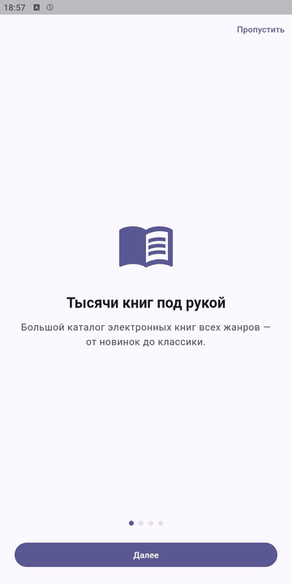</td>
<td>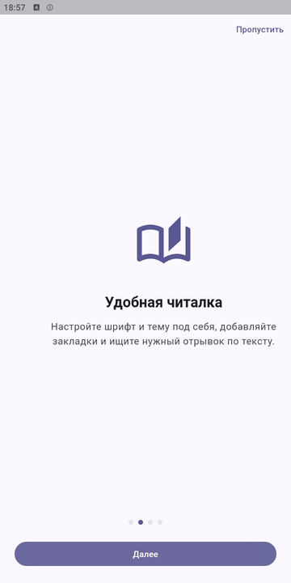</td>
<td>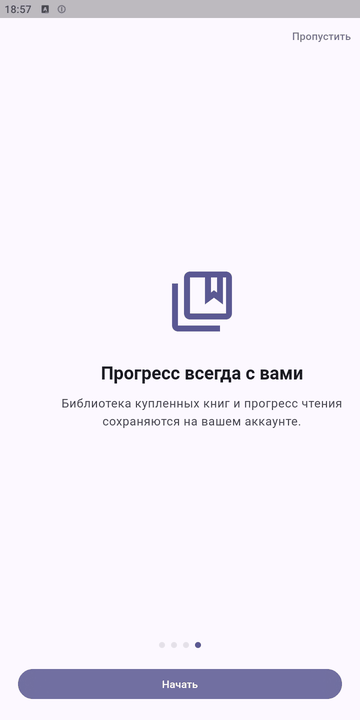</td>
</tr>
</table>

### 3.2 Регистрация, вход и восстановление пароля

После приветствия открывается экран с двумя вкладками: «Вход» и «Регистрация». Под формой есть ссылки «Забыли пароль?» и «Продолжить как гость».

<table>
<tr>
<td>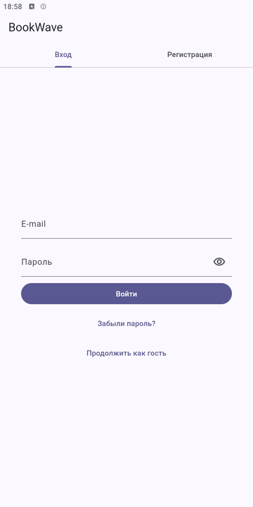</td>
<td>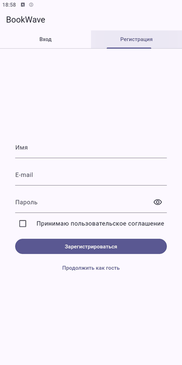</td>
<td>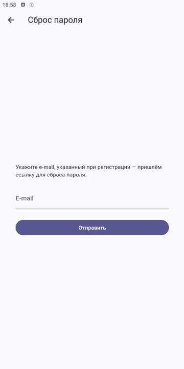</td>
</tr>
</table>

**Как зарегистрироваться**

1. Откройте вкладку «Регистрация».
2. Введите имя (2–50 символов), e-mail и пароль (минимум 8 символов, среди них хотя бы одна цифра).
3. Поставьте галочку «Принимаю пользовательское соглашение».
4. Нажмите «Зарегистрироваться». После регистрации вход выполняется автоматически, на почту приходит приветственное письмо.

**Как войти.** Введите e-mail и пароль и нажмите «Войти». Сессия сохраняется на устройстве, при следующем запуске входить заново не нужно. Три неудачные попытки подряд блокируют вход на 60 секунд, на экране появится сообщение с этим временем.

**Как восстановить пароль**

1. На экране входа нажмите «Забыли пароль?».
2. Введите e-mail, указанный при регистрации, и нажмите «Отправить».
3. Откройте письмо и перейдите по ссылке, она действует 30 минут. Там задайте новый пароль и подтвердите его.

Запросы на сброс пароля ограничены по частоте, слишком частые запросы для одного адреса временно отклоняются.

**Гостевой режим.** «Продолжить как гость» открывает приложение без входа. Гостю доступны две вкладки: «Главная» и «Каталог». Как только он нажимает на сердце или «Добавить в корзину», приложение предлагает войти.

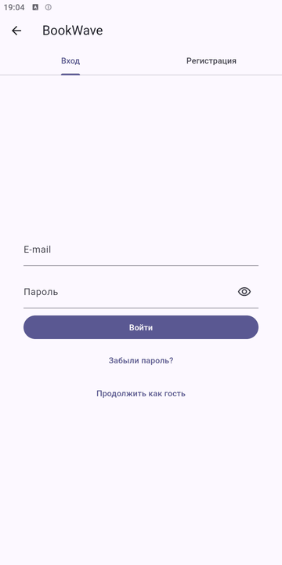

### 3.3 Главная страница

После входа открывается главная. Сверху приветствие по имени и две иконки: корзина и «Моя библиотека». Ниже по порядку:

- **баннеры** — карусель с новинками и акциями, листается сама каждые 5 секунд и вручную свайпом;
- **«Новинки»** — недавно добавленные книги;
- **«Рекомендуем»** — подборка по жанрам книг из избранного и купленных (только для вошедших);
- **«Топ продаж»** — самые покупаемые книги;
- **«Жанры»** — плитки жанров; нажатие открывает каталог с уже выбранным жанром.

Нижняя панель переключает разделы: «Главная», «Каталог», «Библиотека», «Профиль».

<table>
<tr>
<td>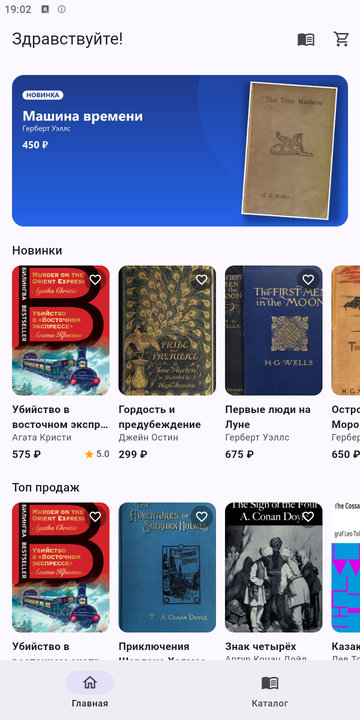</td>
<td>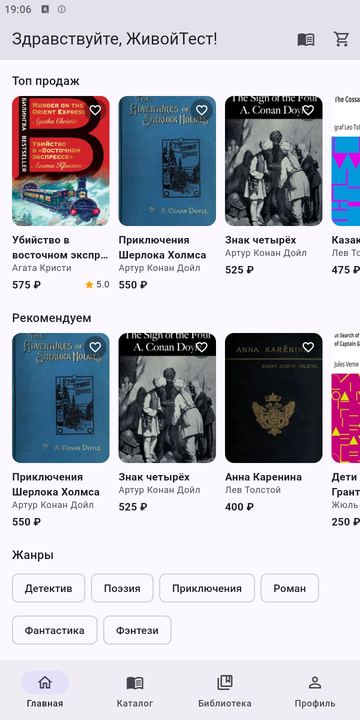</td>
</tr>
</table>

### 3.4 Каталог, поиск, фильтры и сортировка

В каталоге книги показаны сеткой: обложка, название, автор, цена и средний рейтинг. Список подгружается по мере прокрутки вниз.

- **Поиск.** Строка вверху экрана ищет по названию, автору и ISBN. Нужно ввести минимум два символа, результаты обновляются прямо во время набора.
- **Фильтры.** Кнопка с воронкой открывает экран «Фильтры»: жанры (можно выбрать несколько), диапазон цены ползунком, язык и минимальный рейтинг от 1 до 5 звёзд. «Применить» закрывает экран и обновляет список, «Сбросить» очищает всё. Выбранные фильтры показываются тегами над списком, каждый можно снять нажатием на крестик.
- **Сортировка.** Кнопка рядом с воронкой даёт варианты: «По умолчанию», «Сначала дешёвые», «Сначала дорогие», «По рейтингу», «Сначала новинки». Список обновляется сразу.

<table>
<tr>
<td>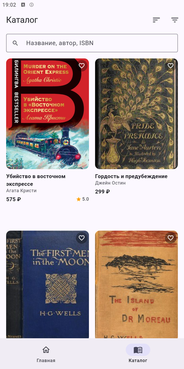</td>
<td>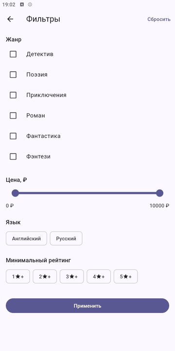</td>
<td>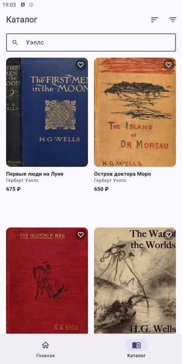</td>
</tr>
</table>

### 3.5 Карточка книги

Нажатие на книгу открывает её карточку. В ней:

- обложка, название, авторы, жанр, язык, издательство, год и объём в страницах;
- цена, средний рейтинг и количество оценок;
- описание и список отзывов других читателей;
- кнопка **«Читать фрагмент»** — ознакомительный отрывок (первые 10–15% текста) доступен без покупки;
- кнопки **«В избранное»** (сердце) и **«Добавить в корзину»**.

Если книга уже куплена, вместо цены и кнопки покупки показывается отметка «Уже в вашей библиотеке» и кнопка «Читать».

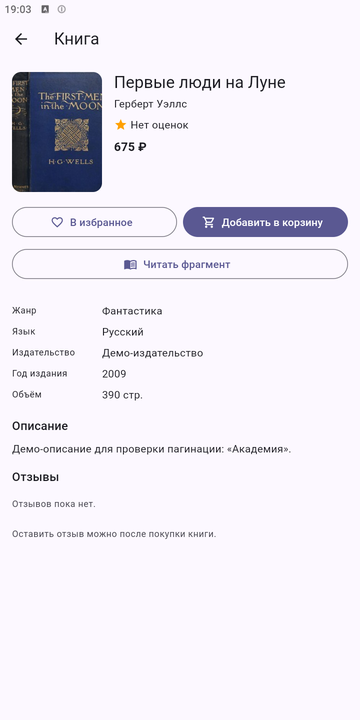

### 3.6 Избранное

Нажмите на сердце на карточке книги или в каталоге — книга добавится в избранное без перехода на другой экран. Повторное нажатие на закрашенное сердце убирает её. Весь список находится в разделе «Профиль → Избранное», оттуда книгу можно открыть или убрать.

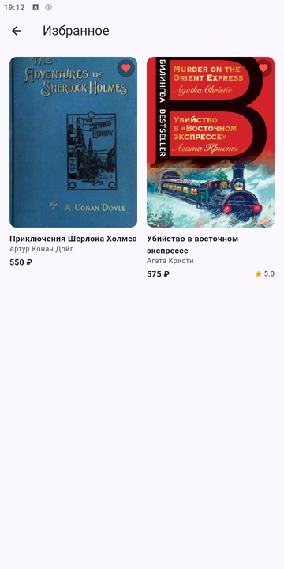

### 3.7 Корзина и промокод

Откройте корзину значком в правом верхнем углу главной. Здесь:

- список выбранных книг с обложкой и ценой; значок корзины справа удаляет позицию;
- поле «Промокод» с кнопкой «Применить» — сервер проверяет код, срок действия и минимальную сумму заказа, а скидка сразу отражается в итоге;
- строки «Сумма товаров», «Скидка по промокоду» и «Итого»;
- кнопка «Оформить заказ».

Повторное добавление книги, которая уже лежит в корзине, дубликата не создаёт. Книгу, которая уже куплена, добавить в корзину нельзя.

<table>
<tr>
<td>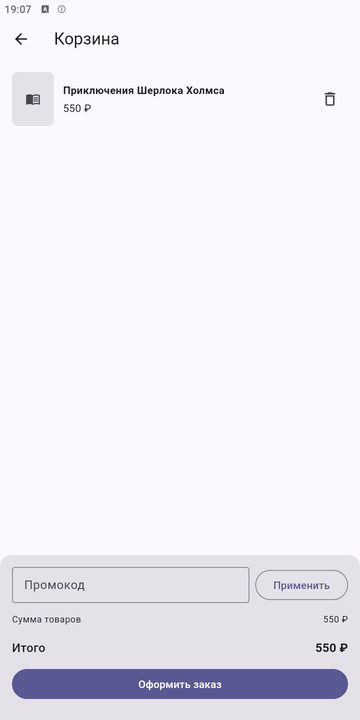</td>
<td>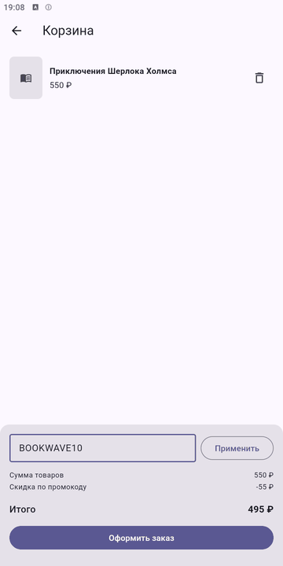</td>
</tr>
</table>

### 3.8 Оформление заказа и оплата

На экране «Оформление заказа» показан итоговый список, сумма и скидка. Оплата здесь имитируется: реальные платёжные данные не нужны и никуда не передаются.

1. Введите номер тестовой карты. Любой номер из 12–19 цифр означает успешную оплату, карта `4000 0000 0000 0002` имитирует отказ.
2. Нажмите «Оплатить».
3. При успехе открывается экран «Заказ успешно оформлен» с номером заказа. Кнопка «Перейти в библиотеку» ведёт к купленным книгам. На почту приходит электронный чек.

При отказе оплаты появится сообщение, заказ не создаётся, а корзина остаётся как была.

<table>
<tr>
<td>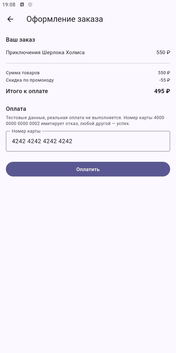</td>
<td>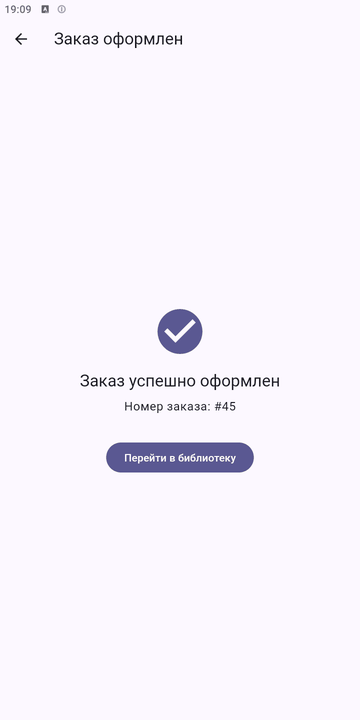</td>
</tr>
</table>

### 3.9 Моя библиотека

Раздел «Библиотека» показывает все купленные книги сеткой. На обложке виден прогресс чтения в процентах, а книги, которые вы ещё не открывали, помечены «Новая». Нажатие на книгу открывает читалку.

Значок корзины на карточке удаляет книгу из библиотеки вместе с прогрессом. Приложение просит подтвердить, действие необратимо.


### 3.10 Читалка

Читалка открывает текст купленной книги. Полная функциональность есть для формата EPUB, файлы PDF и FB2 открываются в базовом режиме просмотра.

В верхней панели есть значки поиска по тексту, оглавления, закладок и настроек отображения.

- **Настройки текста.** Размер шрифта меняется ползунком или кнопками «−» и «+». Тема чтения: «Светлая», «Тёмная» или «Сепия». Переключатель «Непрерывная прокрутка» заменяет постраничное чтение обычной прокруткой.
- **Оглавление.** Список глав, нажатие открывает выбранную главу.
- **Закладки.** Закладка ставится на текущую страницу, их список позволяет вернуться к любой и удалить ненужные.
- **Поиск по тексту.** Введите слово, и в списке появятся найденные фрагменты, а совпадения подсветятся в тексте.
- **Прогресс.** Позиция чтения сохраняется автоматически и синхронизируется между устройствами. Если на двух устройствах записаны разные значения, действует более поздняя запись.

<table>
<tr>
<td>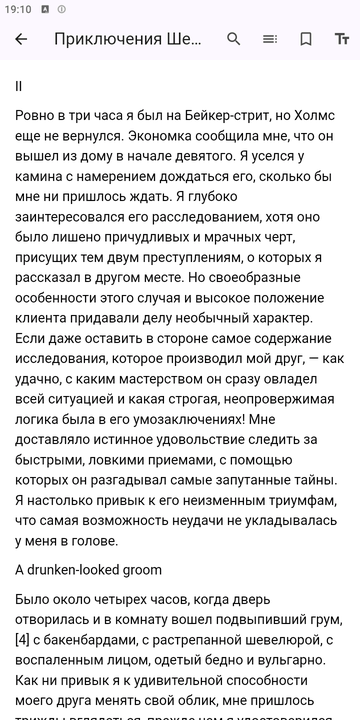</td>
<td>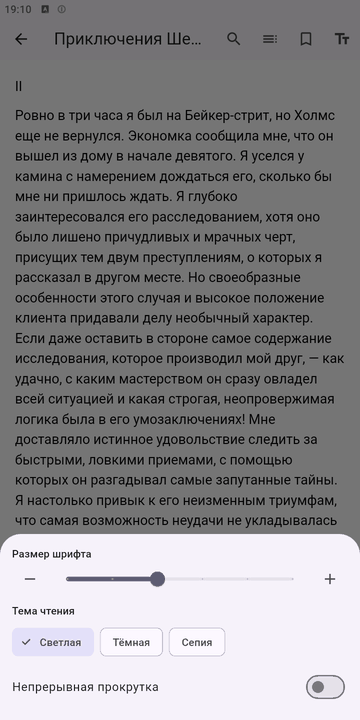</td>
<td>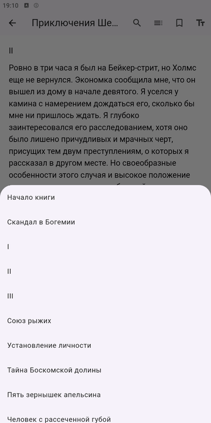</td>
</tr>
</table>

### 3.11 Отзывы и оценки

Оставить отзыв можно только на купленную книгу. Откройте её карточку, прокрутите вниз до блока «Оставить отзыв», выберите от 1 до 5 звёзд и при желании напишите текст (от 10 до 2000 символов), затем нажмите «Отправить». Появится сообщение «Отзыв сохранён», а средний рейтинг книги пересчитается.

На одну книгу можно оставить один отзыв. Его можно отредактировать или удалить позже в том же блоке.

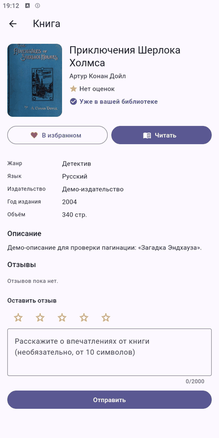

### 3.12 Профиль, заказы и настройки

В разделе «Профиль» видны аватар и имя, ссылка «Изменить профиль» и пункты «Мои заказы», «Избранное», «Настройки», а также кнопка «Выйти».

<table>
<tr>
<td>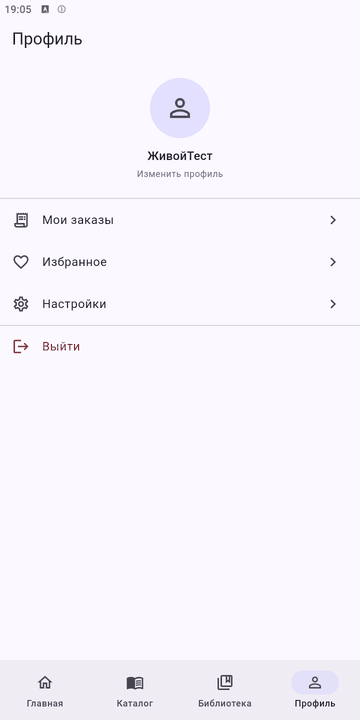</td>
<td>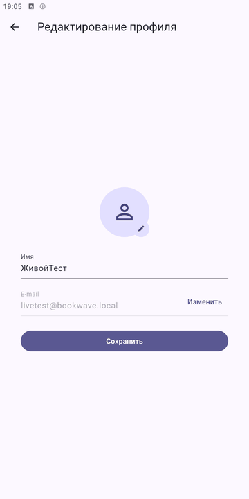</td>
</tr>
</table>

**Редактирование профиля.** Можно изменить имя и загрузить аватар (JPG или PNG, до 5 МБ). Для смены e-mail приложение отправляет письмо на новый адрес, пока вы не перейдёте по ссылке из него, адрес не меняется.

**Мои заказы.** Список всех заказов с датой, суммой и статусом, новые сверху. Нажатие открывает состав заказа и цены книг на момент покупки. Отменить оплаченный заказ самостоятельно нельзя, статус при необходимости меняет администратор.

<table>
<tr>
<td>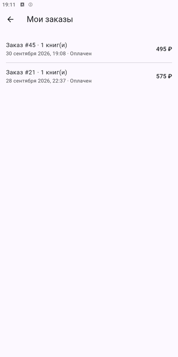</td>
<td>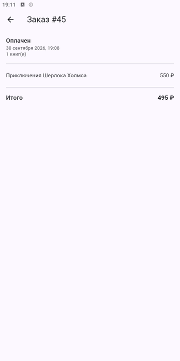</td>
</tr>
</table>

**Настройки.** Здесь меняются:

- тема оформления: светлая, тёмная или как в системе;
- язык интерфейса: русский или английский;
- уведомления по категориям: новинки, статус заказа, ответы на отзывы;
- смена пароля.

**Смена пароля.** Введите текущий пароль и дважды новый. После успешной смены все остальные устройства, где вы были авторизованы, выходят из аккаунта.

<table>
<tr>
<td>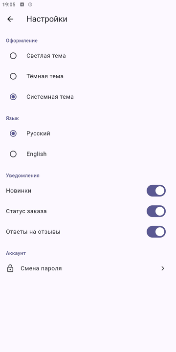</td>
<td>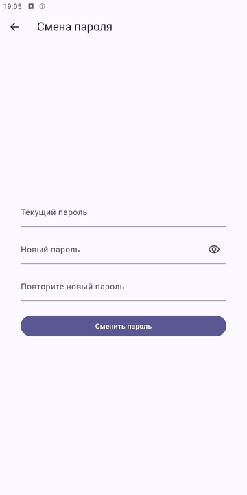</td>
</tr>
</table>

**Выход.** Кнопка «Выйти» в профиле запрашивает подтверждение. После выхода данные сессии на устройстве очищаются, и открывается экран входа.

---

## 4. Веб-панель администратора

Панель открывается в браузере (`http://localhost:8080/` при запуске через Docker) и доступна только администраторам. Слева находится меню разделов, справа рабочая область.

### 4.1 Вход

Введите e-mail и пароль администратора. Без роли «Администратор» вход в панель закрыт.

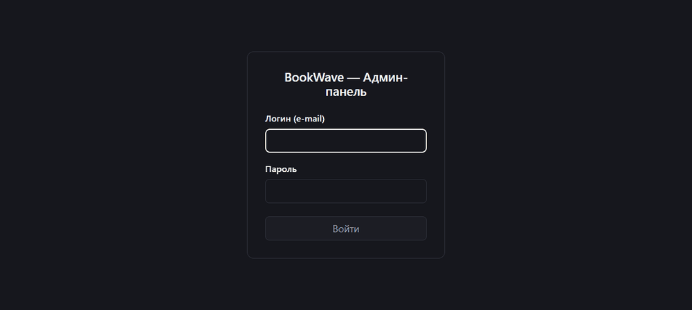

### 4.2 Заказы

Таблица заказов показывает номер, покупателя, сумму, статус и дату, по 25 записей на странице. Над таблицей находятся:

- поиск по номеру заказа или e-mail покупателя;
- фильтр по статусу («Оплачен», «Отменён», «Возврат»);
- выбор диапазона дат «с» и «по»;
- кнопка экспорта списка в Excel.

Нажатие на заказ открывает его карточку: состав, данные покупателя и выпадающий список для смены статуса. Перевод в «Отменён» или «Возврат» панель просит подтвердить.

<table>
<tr>
<td>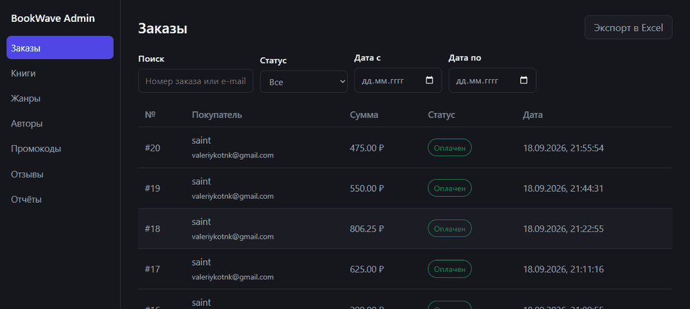</td>
<td>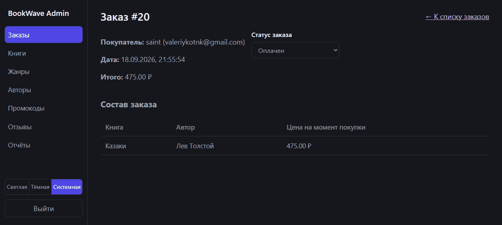</td>
</tr>
</table>

### 4.3 Каталог книг

Список книг с поиском по названию или автору и фильтром по жанру. Кнопка «Добавить книгу» открывает форму:

- название, авторы и жанры (выбираются из справочников);
- язык, издательство, год издания, число страниц;
- ISBN: 10 или 13 цифр, проверяется контрольная цифра, должен быть уникальным;
- цена (не менее 0,01) и описание;
- обложка: JPG или PNG до 5 МБ;
- файл EPUB (обязателен), а также PDF и FB2 по желанию, до 100 МБ каждый. Структуру файла сервер проверяет сам, повреждённый файл не примет.

Редактировать книгу можно из списка. Удаление «мягкое»: книга исчезает из каталога и поиска, но остаётся доступной для чтения тем, кто её уже купил. В списке панели такая книга помечена как удалённая.

<table>
<tr>
<td>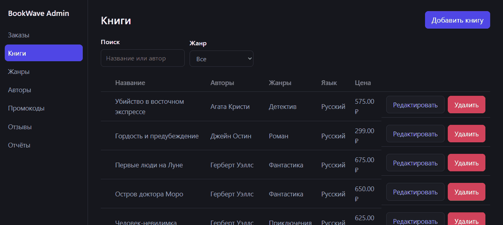</td>
<td>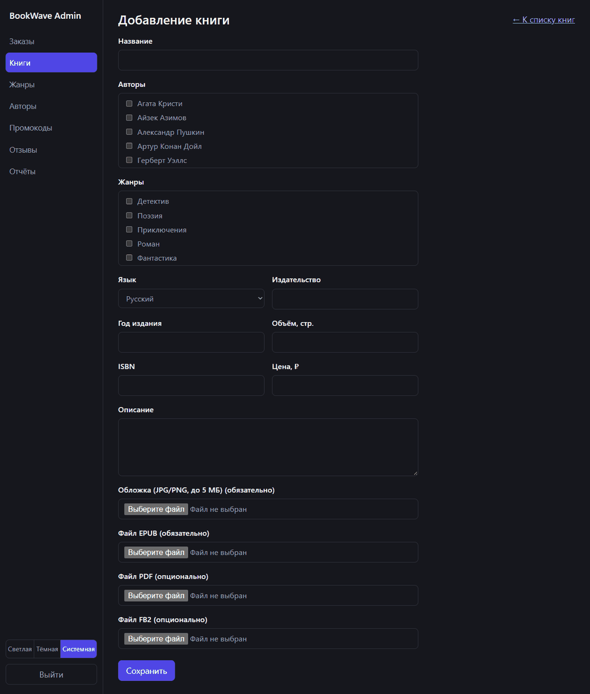</td>
</tr>
</table>

### 4.4 Жанры и авторы

Справочники жанров и авторов: можно добавлять, переименовывать и удалять записи. Название жанра и имя автора должны быть уникальными. Если жанр или автор привязан к книгам, удалить его нельзя, пока он не отвязан от всех книг.

<table>
<tr>
<td>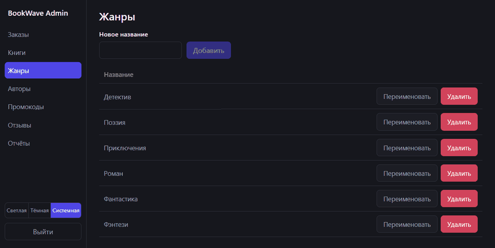</td>
<td>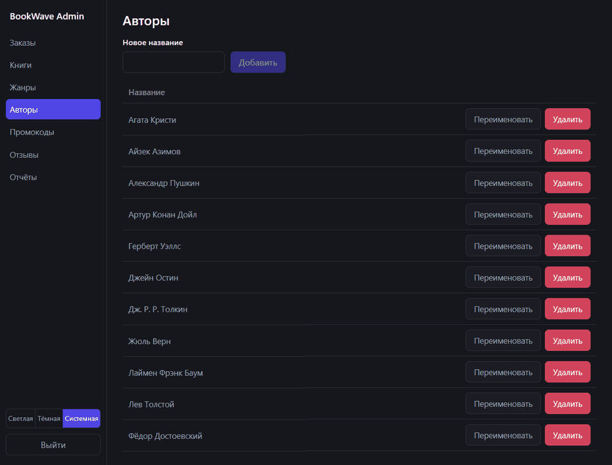</td>
</tr>
</table>

### 4.5 Промокоды

Чтобы создать промокод, задайте:

- уникальный код (регистр не учитывается, до 50 символов);
- тип скидки: процент (не более 100) или фиксированная сумма;
- размер скидки;
- минимальную сумму заказа;
- срок действия: начало должно быть раньше окончания;
- максимальное число использований (необязательно).

Список показывает статус каждого кода: «активен», «истёк» или «исчерпан».

<table>
<tr>
<td>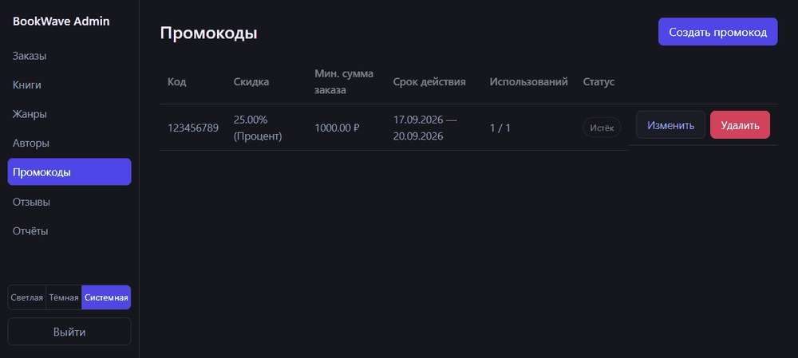</td>
<td>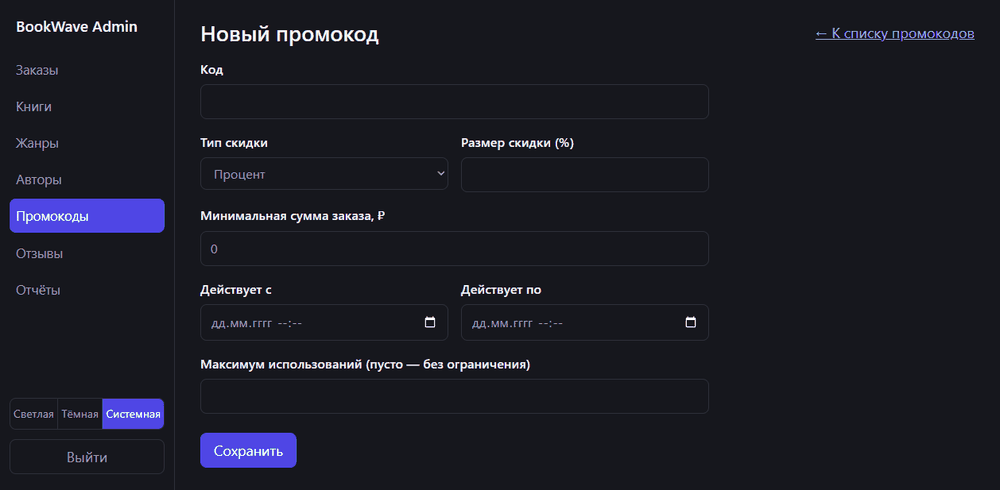</td>
</tr>
</table>

### 4.6 Модерация отзывов

Здесь собраны все отзывы читателей. Отзыв, нарушающий правила, можно скрыть, он перестанет отображаться в приложении. Менять текст чужого отзыва администратор не может.

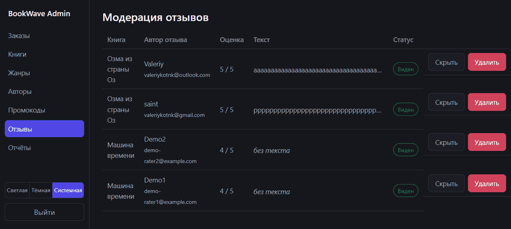

### 4.7 Отчёты

Отчёт о продажах строится за выбранный период: день, неделя, месяц или произвольный диапазон дат. В нём указаны количество заказов, общая выручка и топ-10 самых продаваемых книг. Данные можно выгрузить в `.xlsx` или `.csv`. Границы суток считаются по московскому времени (задаётся переменной `TIME_ZONE` в `backend/.env`).

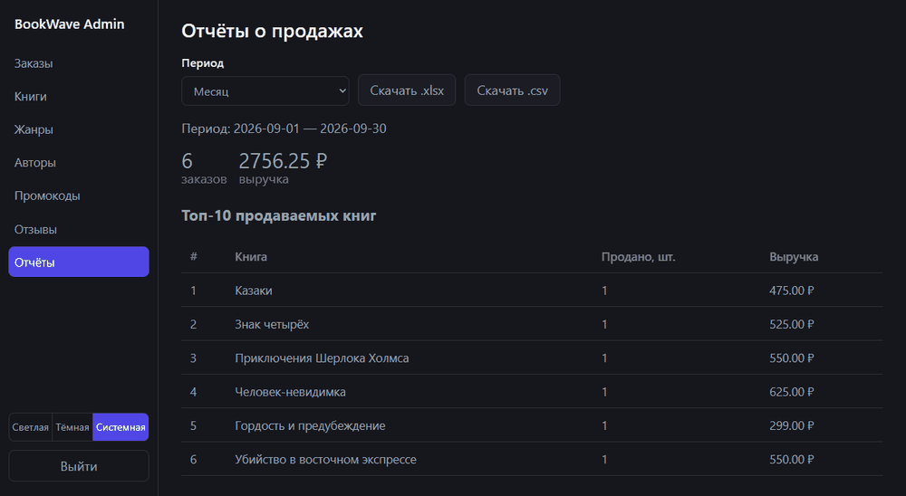

---

## 5. Частые вопросы и неполадки

**Приложение пишет «Не удалось загрузить данные. Проверьте соединение».** Приложение не достаёт до сервера. Проверьте, что:

- сервер запущен (`docker compose ps` показывает работающие контейнеры, а `http://localhost:8000/api/catalog/books/` открывается в браузере);
- устройство и компьютер с сервером в одной сети;
- адрес, зашитый в сборку, совпадает с адресом компьютера. Если IP сменился, пересоберите приложение с нужным `API_BASE_URL` (см. [п. 2.2](#22-мобильное-приложение-android)).

**Сообщение «Слишком много неудачных попыток входа».** Вход блокируется на 60 секунд после трёх ошибок подряд. Подождите минуту и повторите.

**Не приходит письмо для сброса пароля.** В демонстрационном контуре письма не отправляются, а печатаются в журнал сервера: `docker compose logs backend`. Ссылка из письма действует 30 минут. Просить письмо для одного адреса слишком часто нельзя.

**Не могу оставить отзыв.** Отзыв доступен только на купленную книгу и только один на книгу. Если отзыв уже есть, отредактируйте его в той же форме.

**Книгу нельзя добавить в корзину.** Скорее всего, она уже есть в вашей библиотеке. Для гостя кнопки покупки открывают экран входа.

**Оплата отклонена.** В тестовом режиме отказ даёт карта `4000 0000 0000 0002`. Введите любой другой номер из 12–19 цифр.

**Не получается загрузить файл книги в панели.** Проверьте формат и размер: EPUB, PDF или FB2 до 100 МБ, обложка JPG или PNG до 5 МБ. Повреждённый файл или файл другого формата сервер отклонит с сообщением об ошибке.

**Push-уведомления.** В учебной версии подключения к Firebase нет, поэтому уведомления не доставляются на устройство, а выводятся в журнал сервера. Настройки категорий в приложении при этом работают.

---

## 6. Удаление

### 6.1 Мобильное приложение

Удалите приложение как обычно: «Настройки → Приложения → BookWave → Удалить» или долгим нажатием на значок. Вместе с ним удаляются сохранённая сессия и локальные настройки. Учётная запись и купленные книги остаются на сервере, после повторной установки достаточно войти.

### 6.2 Сервер и веб-панель

- `docker compose down` останавливает и удаляет контейнеры. Данные (база, обложки, файлы книг) остаются в томах Docker и вернутся при следующем `docker compose up -d`.
- `docker compose down -v` удаляет в том числе тома с данными. Это необратимо, поэтому сначала сделайте резервную копию (см. [п. 2.1](#21-сервер-и-веб-панель)).

Веб-панель работает в браузере, отдельного удаления она не требует.
